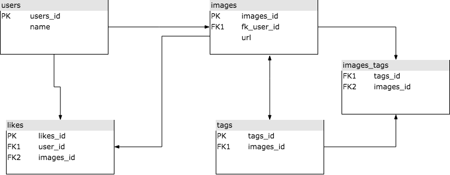

# Diagrama de flujo

# Comandos Postgres

CREATE DATABASE pictogram;

\c pictogram
psql (10.4, server 10.5)
You are now connected to database "pictogram" as user "gonzalosalinas".

pictogram=# CREATE TABLE users (
pictogram(# id SERIAL PRIMARY KEY,
pictogram(# name VARCHAR(30)
pictogram(# );
CREATE TABLE

pictogram=# CREATE TABLE images (
id SERIAL PRIMARY KEY,
users_id integer REFERENCES users (id),
pictogram(# url VARCHAR(256);

pictogram=# CREATE TABLE likes (
users_id integer REFERENCES users (id),
images_id integer REFERENCES images(id), PRIMARY KEY (users_id, images_id));
CREATE TABLE

pictogram=# CREATE TABLE tags (
pictogram(# id SERIAL PRIMARY KEY,
pictogram(# tag VARCHAR(30));
CREATE TABLE

pictogram=# CREATE TABLE image_tag (
images_id integer REFERENCES images (id),
tags_id integer REFERENCES tags(id), PRIMARY KEY (images_id, tags_id));
CREATE TABLE

pictogram=# INSERT INTO users (name) VALUES ('Pedro');
INSERT 0 1
pictogram=# INSERT INTO users (name) VALUES ('Juan');
INSERT 0 1
pictogram=# INSERT INTO users (name) VALUES ('Diego');
INSERT 0 1

pictogram=# INSERT INTO images (users_id, url) VALUES (1, 'https://bit.ly/2mka0Wj');
INSERT 0 1
pictogram=# INSERT INTO images (users_id, url) VALUES (2, 'https://bit.ly/2KZmFIn');
INSERT 0 1
pictogram=# INSERT INTO images (users_id, url) VALUES (1, 'https://bit.ly/2BkwroQ');
INSERT 0 1
pictogram=# INSERT INTO images (users_id, url) VALUES (2, 'https://bit.ly/2KZmFIn');
INSERT 0 1
pictogram=#
